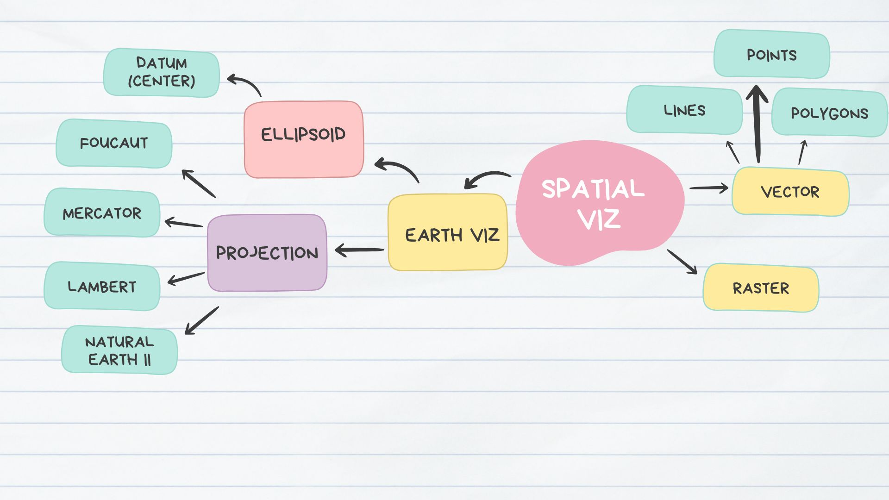

# Mind Maps

## Data Visualization

## Spatial Vizualization

# Advanced Wrangling 1

# Advanced Wrangling 2

# Missing functions

# Functions

{width=100%}

# Base R

{width=100%}

# Loops and Iter

{width=100%}

# APIs

{width=100%}

# Web Scraping

{width=100%}

# Databases and SQL

{width=100%}

# Effective Viz

{width=100%}

# Interactive Viz

{width=100%}

# Quality Control

{width=100%}
